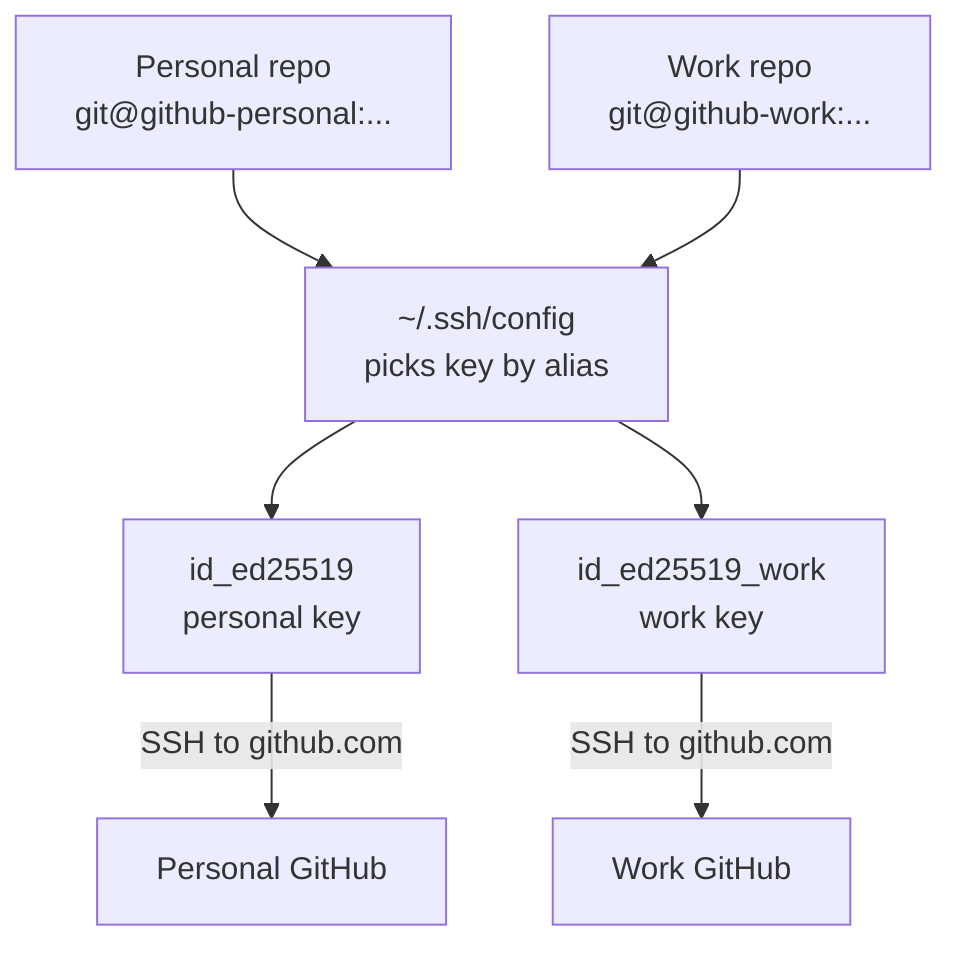
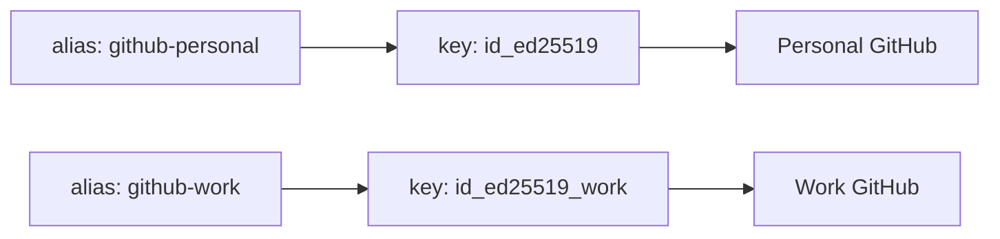
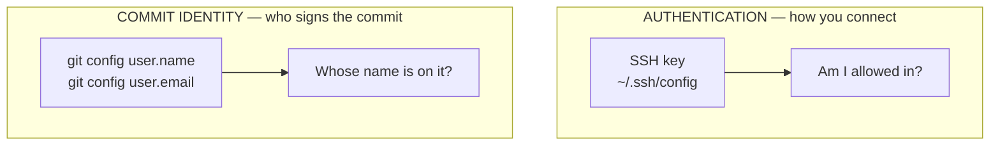
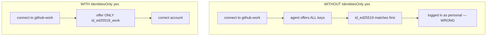
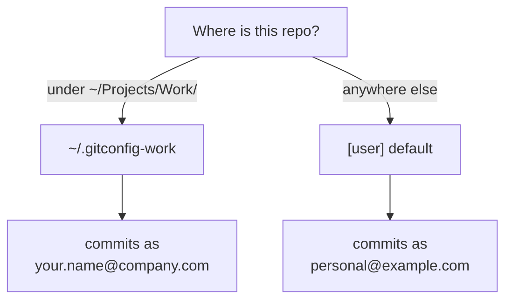
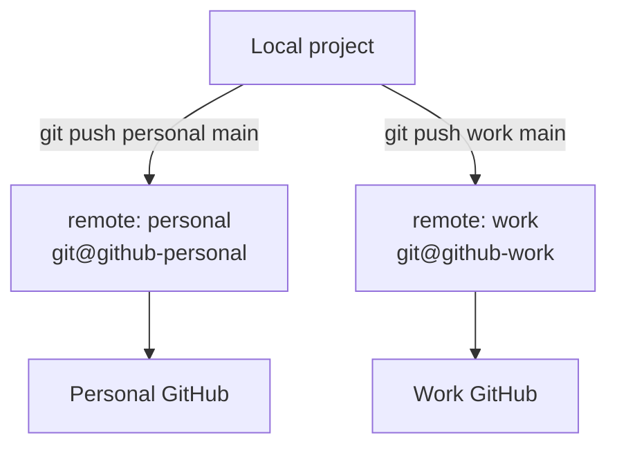
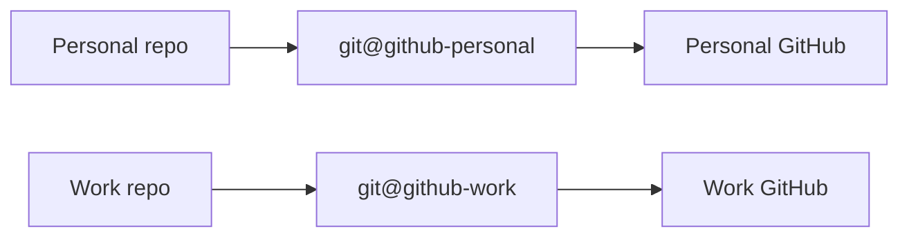

# Managing Personal and Work GitHub Accounts on One Computer

A complete step-by-step guide for using **multiple GitHub accounts** (for example, a personal GitHub account and a company/organization GitHub account) on the same computer using SSH authentication.

Commands are shown for **Windows PowerShell** first, with **macOS/Linux** equivalents noted where they differ. The concepts are identical across all platforms.

This guide covers:

* Setting up multiple SSH keys
* Configuring SSH aliases (host aliases)
* Connecting each key to the correct GitHub account
* Cleaning up duplicate / cached SSH keys
* Configuring Git commit identities per account (manually and automatically)
* Pushing code to personal and work repositories
* Syncing one project with multiple GitHub accounts

---

## The Big Picture

Everything in this guide builds toward one routing setup: two keys, two aliases, one machine.



The **host alias** in the URL (`github-personal` vs `github-work`) is what tells SSH which key to use — that is the whole trick.

---

# Table of Contents

- [1. Understanding Git Identity vs GitHub Authentication](#1-understanding-git-identity-vs-github-authentication)
- [2. Prerequisites](#2-prerequisites)
- [3. Checking Existing SSH Setup](#3-checking-existing-ssh-setup)
- [4. Creating a Work SSH Key](#4-creating-a-work-ssh-key)
- [5. Starting ssh-agent and Adding Keys](#5-starting-ssh-agent-and-adding-keys)
- [6. Adding SSH Keys to GitHub](#6-adding-ssh-keys-to-github)
- [7. Creating the SSH Configuration File](#7-creating-the-ssh-configuration-file)
- [8. Testing Both GitHub Accounts](#8-testing-both-github-accounts)
- [9. Cleaning Up Duplicate / Cached Keys](#9-cleaning-up-duplicate--cached-keys)
- [10. Configuring Git Commit Identity](#10-configuring-git-commit-identity)
- [11. Recommended Workflow](#11-recommended-workflow)
- [12. Using One Repository With Multiple GitHub Accounts](#12-using-one-repository-with-multiple-github-accounts)
- [13. Automatically Push to Multiple Accounts](#13-automatically-push-to-multiple-accounts)
- [14. Troubleshooting](#14-troubleshooting)
- [15. Quick Reference](#15-quick-reference)
- [Final Recommended Setup](#final-recommended-setup)

---

# 1. Understanding Git Identity vs GitHub Authentication

Git uses two **separate and independent** concepts. Confusing them is the root cause of most multi-account problems.

## GitHub Authentication

This answers:

> "Which GitHub account am I connecting to, and am I allowed in?"

Handled by:

* SSH keys (the credential)
* The SSH config file (which key to use for which alias)



## Git Commit Identity

This answers:

> "Whose name and email are recorded as the author of each commit?"

Controlled by:

```bash
git config user.name
git config user.email
```

| | Name | Email |
|---|---|---|
| **Personal** | Your Name | `personal@example.com` |
| **Work** | Your Name | `your.name@company.com` |

## Two Independent Systems

These two systems do not talk to each other — you configure each one separately:



> **Key point:** Because they are independent, you can authenticate with your work key but still commit with your personal email if you are not careful — this guide shows how to keep them aligned (see [Section 10](#10-configuring-git-commit-identity)).

---

# 2. Prerequisites

You need:

* **Git** installed
* One or more **GitHub accounts**
* **OpenSSH** (bundled with Git and included in modern Windows, macOS, and Linux)

Check Git:

```powershell
git --version
```

Check SSH:

```powershell
ssh -V
```

If either command is not found, install [Git](https://git-scm.com/downloads) (which includes OpenSSH) before continuing.

---

# 3. Checking Existing SSH Setup

Look at your SSH folder to see what already exists.

```powershell
cd ~/.ssh
ls
```

> On macOS/Linux use `ls -la ~/.ssh` to also show the hidden `config` file.

Typical files:

```
id_ed25519       # private key  (NEVER share this)
id_ed25519.pub   # public key   (safe to share)
known_hosts
```

The default key `id_ed25519` is usually your **personal** GitHub key. If the `.ssh` folder is empty, you will create both keys below.

> ⚠️ **Never share, commit, or paste a private key** (a file with **no** `.pub` extension). Only `.pub` files are meant to be uploaded to GitHub.

---

# 4. Creating a Work SSH Key

**Do NOT overwrite your existing key.** Create a second one with a distinct filename.

```powershell
ssh-keygen -t ed25519 -C "your.name@company.com"
```

* `-t ed25519` — the recommended modern key type.
* `-C "..."` — a comment/label (typically your email) so you can identify the key later. It does **not** affect authentication.

When prompted:

```
Enter file in which to save the key:
```

**Do NOT press Enter** (that would target the default `id_ed25519` and could overwrite your personal key). Type a distinct path:

```
~/.ssh/id_ed25519_work
```

On Windows the resolved path looks like:

```
C:\Users\<YourUser>\.ssh\id_ed25519_work
```

Set a passphrase when asked (recommended). After completion you will have:

```
id_ed25519_work       # private key
id_ed25519_work.pub   # public key
```

---

# 5. Starting ssh-agent and Adding Keys

The **ssh-agent** holds your unlocked keys so you don't retype the passphrase every time.

### Windows

Check the agent service:

```powershell
Get-Service ssh-agent
```

Start it (and make it start automatically on boot):

```powershell
Start-Service ssh-agent
Set-Service ssh-agent -StartupType Automatic
```

> If `Set-Service` reports an access error, run PowerShell **as Administrator** for that one command.

### macOS / Linux

The agent usually runs already. If not:

```bash
eval "$(ssh-agent -s)"
```

### Add both keys (all platforms)

```powershell
ssh-add ~/.ssh/id_ed25519
ssh-add ~/.ssh/id_ed25519_work
```

> On macOS, store the passphrase in the keychain with:
> `ssh-add --apple-use-keychain ~/.ssh/id_ed25519_work`

Verify the loaded keys:

```powershell
ssh-add -l
```

Expected (fingerprints will differ):

```
256 SHA256:xxxxx personal@example.com (ED25519)
256 SHA256:yyyyy your.name@company.com (ED25519)
```

---

# 6. Adding SSH Keys to GitHub

You upload the **public** key (`.pub`) to each corresponding GitHub account.

Copy a public key to the clipboard:

```powershell
# Personal
Get-Content ~/.ssh/id_ed25519.pub | Set-Clipboard

# Work
Get-Content ~/.ssh/id_ed25519_work.pub | Set-Clipboard
```

> macOS: `pbcopy < ~/.ssh/id_ed25519.pub` — Linux: `xclip -sel clip < ~/.ssh/id_ed25519.pub`
> Or just print it with `Get-Content ~/.ssh/id_ed25519.pub` and copy manually.

Then, **while signed in to the matching account**:

1. GitHub → click your profile picture → **Settings**
2. **SSH and GPG keys** → **New SSH key**
3. **Title:** a device/account label, e.g. `Personal Laptop` or `Company Laptop`
4. **Key type:** `Authentication Key`
5. **Key:** paste the public key
6. **Add SSH key**

Repeat for the work account, **signed in to the work account**, using `id_ed25519_work.pub`.

> Make sure each public key is added to the correct account. The personal key goes on the personal account; the work key on the work account.

## Authorize the Work Key for Your Organization (SAML SSO)

Many companies protect their repositories with **SAML single sign-on (SSO)**. When that is enabled, adding the key to your account is not enough on its own — you must also **authorize the key for the organization** before you can clone or push its repositories. Do this right after adding the work key:

1. Open your SSH key settings: [https://github.com/settings/keys](https://github.com/settings/keys)
2. Find the work key you just added (e.g. titled `Company Laptop`).
3. Click **Configure SSO** next to that key.
4. Click **Authorize** next to your organization's name.
5. Complete your company sign-in if prompted.

The key is now trusted for that organization and will work for cloning and pushing to its repositories.

> If your organization does not use SSO, you can skip this step. If you are unsure, do it anyway — it is harmless.

---

# 7. Creating the SSH Configuration File

The config file maps a **host alias** to a specific key. This is what lets one machine reach two accounts on the same `github.com`.

Create the file at:

```
~/.ssh/config
```

The filename must be exactly `config` — **not** `config.txt`.

> **Windows tip:** Notepad often adds a hidden `.txt`. Create it from PowerShell instead:
> ```powershell
> notepad $HOME\.ssh\config
> ```
> Save it, then confirm with `ls ~/.ssh` that the file is named `config` with no extension.

Contents:

```ssh-config
# Personal GitHub
Host github-personal
    HostName github.com
    User git
    IdentityFile ~/.ssh/id_ed25519
    IdentitiesOnly yes

# Work GitHub
Host github-work
    HostName github.com
    User git
    IdentityFile ~/.ssh/id_ed25519_work
    IdentitiesOnly yes
```

What each line does:

* `Host github-personal` — the **alias** you type in URLs (`git@github-personal:...`).
* `HostName github.com` — the real server both aliases connect to.
* `User git` — GitHub always authenticates SSH as the `git` user.
* `IdentityFile` — which private key to use for this alias.
* `IdentitiesOnly yes` — **use only the listed key**. Without this, ssh-agent offers every loaded key and GitHub logs you in as whichever key it recognizes first — the #1 cause of "wrong account" errors. **Do not omit this line.**

Why `IdentitiesOnly yes` matters:



---

# 8. Testing Both GitHub Accounts

Test personal:

```powershell
ssh -T git@github-personal
```

Expected:

```
Hi personal-username! You've successfully authenticated, but GitHub does not provide shell access.
```

Test work:

```powershell
ssh -T git@github-work
```

Expected:

```
Hi work-username! You've successfully authenticated, but GitHub does not provide shell access.
```

> The first time you connect you'll see a prompt about the authenticity of `github.com` — type `yes` to add it to `known_hosts`.
>
> The message says GitHub "does not provide shell access" — that is expected and means success.

If the wrong username appears, jump to [Troubleshooting](#14-troubleshooting).

---

# 9. Cleaning Up Duplicate / Cached Keys

Sometimes `ssh-add -l` shows extra or stale keys:

```
SHA256:key1 personal@example.com
SHA256:key2 personal@example.com   # duplicate / old
SHA256:key3 your.name@company.com
```

Identify the fingerprint of a key file directly:

```powershell
ssh-keygen -lf ~/.ssh/id_ed25519.pub
```

Reset the agent and re-add only the keys you want:

```powershell
ssh-add -D                       # remove all keys from the agent
ssh-add ~/.ssh/id_ed25519
ssh-add ~/.ssh/id_ed25519_work
ssh-add -l                       # verify: exactly two keys
```

> `ssh-add -D` only clears the agent's memory; it does **not** delete any key files.

---

# 10. Configuring Git Commit Identity

There is no global "correct" identity — set it per repository (or automate it) so personal repos use your personal email and work repos use your work email.

## Option A — Set per repository (simple, explicit)

Run inside each repository after cloning:

**Personal repo:**

```powershell
git config user.name "Your Name"
git config user.email "personal@example.com"
```

**Work repo:**

```powershell
git config user.name "Your Name"
git config user.email "your.name@company.com"
```

Verify inside a repo:

```powershell
git config user.email
```

## Option B — Automatic per-folder identity (recommended)

Git can switch identity automatically based on where a repository lives, so you never forget. This uses `includeIf` in your **global** Git config.

Assume you keep repos like this:

```
~/Projects/Personal/...
~/Projects/Work/...
```

Edit your global config:

```powershell
notepad $HOME\.gitconfig
```

Add:

```ini
[user]
    name = Your Name
    email = personal@example.com        # default identity

[includeIf "gitdir:~/Projects/Work/"]
    path = ~/.gitconfig-work
```

Create `~/.gitconfig-work`:

```ini
[user]
    email = your.name@company.com
```

Now any repo under `~/Projects/Work/` automatically commits with your work email; everything else uses the personal default.

How Git decides which email to use, based on where the repo lives:



> The trailing slash in `gitdir:~/Projects/Work/` matters — it means "this directory and everything under it." On Windows, `~` resolves to your user home folder.

Confirm which identity a repo resolved to:

```powershell
git config user.email
```

---

# 11. Recommended Workflow

Keep personal and work repositories in **separate folders**. This prevents mixing remotes, identities, and accidental cross-pushes.

```
Projects/
├── Personal/
│   └── project-a/
└── Work/
    └── company-project/
```

Clone using the **host alias** from your SSH config (not `github.com`):

**Personal:**

```powershell
git clone git@github-personal:personal-username/project-a.git
```

**Work:**

```powershell
git clone git@github-work:organization-name/company-project.git
```

> The part after the colon is `owner/repository`. Use your **username** for personal repos and the **organization name** for work repos. Copy the real `owner/repo` from the GitHub repository page and just swap `github.com` for your alias.

Cloning through the alias means the correct key is used automatically for every future `pull`/`push` in that repo — no per-command flags needed.

This separation prevents:

* Accidentally pushing company code to a personal (possibly public) repo
* Commits authored with the wrong email
* Authentication confusion

---

# 12. Using One Repository With Multiple GitHub Accounts

A single local folder can push to more than one account by having multiple **named remotes**.



Initialize and make a first commit:

```powershell
git init
git add .
git commit -m "Initial commit"
```

Add two remotes using the aliases:

```powershell
git remote add personal git@github-personal:personal-username/project.git
git remote add work git@github-work:organization-name/project.git
```

Check them:

```powershell
git remote -v
```

Push to each explicitly:

```powershell
git push personal main
git push work main
```

> This keeps the two destinations independent — you choose which one to push to each time.

---

# 13. Automatically Push to Multiple Accounts

You can make a single remote push to **two destinations at once**.

```powershell
git remote add origin git@github-personal:personal-username/project.git
git remote set-url --add --push origin git@github-work:organization-name/project.git
```

Now:

```powershell
git push origin main
```

pushes to **both** the personal and work repositories.

## ⚠️ Warning

**Avoid this for company projects.** Reasons:

* Company code can accidentally end up on personal (potentially public) GitHub
* It may violate your employer's security or IP policies
* Once pushed publicly, code can be cached or forked before you can delete it

**Recommended:** use separate repositories (Section 11) unless you have explicit authorization to mirror.

---

# 14. Troubleshooting

## "Could not resolve hostname github-work"

**Cause:** the SSH config isn't being read (missing file, wrong name, or wrong location).

**Fix:**

```powershell
ls ~/.ssh
```

Confirm a file named exactly `config` exists (not `config.txt`, and located in `~/.ssh`). Recreate it per [Section 7](#7-creating-the-ssh-configuration-file) if needed.

## Wrong GitHub account appears (`Hi wrong-username!`)

**Most common cause:** `IdentitiesOnly yes` is missing from your SSH config, so the agent offers the wrong key first.

**Fix:**

1. Add `IdentitiesOnly yes` under **both** hosts in `~/.ssh/config` (see [Section 7](#7-creating-the-ssh-configuration-file)).
2. Reset the agent:

   ```powershell
   ssh-add -D
   ssh-add ~/.ssh/id_ed25519
   ssh-add ~/.ssh/id_ed25519_work
   ```
3. Re-test: `ssh -T git@github-work`

## Verify which key is being offered

```powershell
ssh -vT git@github-work
```

Look for lines like:

```
Offering public key: ~/.ssh/id_ed25519_work ...
Authenticated to github.com ... using "publickey"
```

Confirm the **expected key file** is the one that authenticates.

## "Permission denied (publickey)"

* The public key isn't added to that GitHub account, or was added to the wrong account → re-check [Section 6](#6-adding-ssh-keys-to-github).
* The key isn't loaded in the agent → `ssh-add -l`, then re-add it.
* Wrong `IdentityFile` path in `~/.ssh/config`.

## A repo still uses the old account after you fixed the config

The remote URL was probably cloned with `github.com` instead of the alias. Check and fix:

```powershell
git remote -v
git remote set-url origin git@github-work:organization-name/project.git
```

## Passphrase prompts every session (Windows)

Ensure the agent starts automatically:

```powershell
Set-Service ssh-agent -StartupType Automatic
```

---

# 15. Quick Reference

| Task | Command |
|---|---|
| Create work key | `ssh-keygen -t ed25519 -C "your.name@company.com"` (save as `id_ed25519_work`) |
| Start agent (Win) | `Start-Service ssh-agent` |
| Add key | `ssh-add ~/.ssh/id_ed25519_work` |
| List loaded keys | `ssh-add -l` |
| Clear agent | `ssh-add -D` |
| Copy public key (Win) | `Get-Content ~/.ssh/id_ed25519.pub \| Set-Clipboard` |
| Test connection | `ssh -T git@github-work` |
| Debug connection | `ssh -vT git@github-work` |
| Clone (work) | `git clone git@github-work:organization-name/project.git` |
| Set commit email | `git config user.email "your.name@company.com"` |
| List remotes | `git remote -v` |

---

# Final Recommended Setup

Your final `~/.ssh` folder:

```
.ssh/
├── config
├── id_ed25519         # personal (private)
├── id_ed25519.pub     # personal (public)
├── id_ed25519_work    # work (private)
├── id_ed25519_work.pub# work (public)
└── known_hosts
```

ssh-agent holds:

```
✓ Personal GitHub key
✓ Work GitHub key
```

Git routing:



Result: a clean, secure, and reliable way to manage multiple GitHub accounts on one computer — with authentication and commit identity kept correctly separated.
