# Git & GitHub Guide

A complete, step-by-step guide to using Git and GitHub — from installing Git for the very first time through advanced multi-account setups.

Commands are shown for **Windows PowerShell** first, with **macOS/Linux** equivalents noted where they differ. The concepts are identical across all platforms.

## Which part do I need?

| You are... | Start at |
|---|---|
| Brand new to Git and GitHub, and only need your **company (organization) GitHub account** | **[Part 1](#part-1-getting-started-with-git-and-github-single-organization-account)** — read it start to finish, then stop. That's everything you need. |
| Already comfortable with Git, and need a **personal account and a work account on the same computer** | **[Part 2](#part-2-managing-personal-and-work-accounts-on-one-computer)** |
| Finished Part 1, and now *also* need a personal account on this same computer (or vice versa) | **[Part 2](#part-2-managing-personal-and-work-accounts-on-one-computer)** — it's designed to build on top of what Part 1 set up |

**Part 1 — Getting Started** covers:

* Installing Git
* Creating/joining your GitHub organization account
* SSH key setup (one account)
* Cloning, committing, pushing, and pulling
* Branches and Pull Requests
* A command cheat sheet, common beginner errors, and a glossary

**Part 2 — Advanced** covers:

* Setting up multiple SSH keys
* Configuring SSH aliases (host aliases)
* Connecting each key to the correct GitHub account
* Cleaning up duplicate / cached SSH keys
* Configuring Git commit identities per account (manually and automatically)
* Pushing code to personal and work repositories
* Syncing one project with multiple GitHub accounts

---

# Table of Contents

**Part 1 — Getting Started (Organization Account Only)**

- [1. What Are Git and GitHub?](#1-what-are-git-and-github)
- [2. Installing Git](#2-installing-git)
- [3. Getting Your GitHub Organization Account](#3-getting-your-github-organization-account)
- [4. Setting Up SSH Authentication](#4-setting-up-ssh-authentication)
- [5. Setting Your Git Identity](#5-setting-your-git-identity)
- [6. Cloning Your First Repository](#6-cloning-your-first-repository)
- [7. The Basic Everyday Workflow](#7-the-basic-everyday-workflow)
- [8. Working with Branches](#8-working-with-branches)
- [9. Collaborating with Pull Requests](#9-collaborating-with-pull-requests)
- [10. Keeping Your Local Copy Up to Date](#10-keeping-your-local-copy-up-to-date)
- [11. Undoing Mistakes Safely](#11-undoing-mistakes-safely)
- [12. Ignoring Files You Don't Want to Commit (.gitignore)](#12-ignoring-files-you-dont-want-to-commit-gitignore)
- [13. Resolving a Merge Conflict](#13-resolving-a-merge-conflict)
- [14. Git and GitHub Cheat Sheet](#14-git-and-github-cheat-sheet)
- [15. Common Beginner Errors and Fixes](#15-common-beginner-errors-and-fixes)
- [16. Glossary of Terms](#16-glossary-of-terms)

**Bonus — Beyond the Basics**

- [Beyond the Basics: How Professional Teams Work at Scale](#beyond-the-basics-how-professional-teams-work-at-scale)

**Part 2 — Advanced: Multiple GitHub Accounts on One Computer**

- [17. Understanding Git Identity vs GitHub Authentication](#17-understanding-git-identity-vs-github-authentication)
- [18. Prerequisites](#18-prerequisites)
- [19. Checking Existing SSH Setup](#19-checking-existing-ssh-setup)
- [20. Creating a Work SSH Key](#20-creating-a-work-ssh-key)
- [21. Starting ssh-agent and Adding Keys](#21-starting-ssh-agent-and-adding-keys)
- [22. Adding SSH Keys to GitHub](#22-adding-ssh-keys-to-github)
- [23. Creating the SSH Configuration File](#23-creating-the-ssh-configuration-file)
- [24. Testing Both GitHub Accounts](#24-testing-both-github-accounts)
- [25. Cleaning Up Duplicate / Cached Keys](#25-cleaning-up-duplicate--cached-keys)
- [26. Configuring Git Commit Identity](#26-configuring-git-commit-identity)
- [27. Recommended Workflow](#27-recommended-workflow)
- [28. Using One Repository With Multiple GitHub Accounts](#28-using-one-repository-with-multiple-github-accounts)
- [29. Automatically Push to Multiple Accounts](#29-automatically-push-to-multiple-accounts)
- [30. Troubleshooting (Multi-Account)](#30-troubleshooting-multi-account)
- [31. Quick Reference (Multi-Account)](#31-quick-reference-multi-account)
- [Final Recommended Setup](#final-recommended-setup)

---

# Part 1: Getting Started with Git and GitHub (Single Organization Account)

This part assumes **zero prior experience**. It is written for someone who only needs access to their company's GitHub organization — no personal GitHub account, no juggling multiple identities. Follow the sections in order.

⏱ Estimated time: 30–45 minutes, done once.

---

# 1. What Are Git and GitHub?

Two different things, often confused:

* **Git** is a program installed on *your* computer. It keeps a complete history of every change made to a project's files, so nothing is ever truly lost and multiple people can work on the same project without overwriting each other.
* **GitHub** is a website that hosts a copy of a Git project "in the cloud" so your team can share it, review each other's changes, and keep a backup that isn't just sitting on one laptop.

A simple analogy: Git is an infinite "undo history" with save-points for your whole project folder. GitHub is the shared drive where your team's save-points live.


A few words you'll see constantly (full [Glossary](#16-glossary-of-terms) at the end of Part 1):

| Term | Meaning |
|---|---|
| **Repository ("repo")** | A project's folder plus its whole history |
| **Commit** | A saved snapshot of changes, with a message |
| **Branch** | An independent line of work |
| **Clone** | Download a full copy of a repo to your computer |
| **Push** | Upload your commits to GitHub |
| **Pull** | Download teammates' commits from GitHub |
| **Remote** | A copy of the repo hosted elsewhere (e.g. GitHub) |
| **Pull Request (PR)** | A request on GitHub to merge your branch into the project |

---

# 2. Installing Git

You'll type commands into a terminal — on Windows that's **PowerShell** (already installed), on macOS/Linux that's **Terminal**.

### Windows

1. Download the installer from [git-scm.com/downloads](https://git-scm.com/downloads).
2. Run it. The default options are fine for beginners — just keep clicking **Next**.
3. Close and reopen PowerShell after installation (so it picks up the new command).

### macOS

Run the version check below — macOS will offer to install the Command Line Developer Tools automatically if Git isn't present:

```bash
git --version
```

Or, if you use [Homebrew](https://brew.sh):

```bash
brew install git
```

### Linux

```bash
sudo apt install git      # Debian / Ubuntu
sudo dnf install git      # Fedora
```

### Verify it worked (all platforms)

```powershell
git --version
```

You should see something like `git version 2.44.0`.

> 💡 **GUI alternatives exist** (GitHub Desktop, VS Code's built-in Git panel, etc.) and are perfectly valid. This guide teaches the command line because it works identically everywhere and every GUI is just a visual wrapper around the same commands you'll learn here.

---

# 3. Getting Your GitHub Organization Account

1. If your company invited you, check your email for an invitation to join their GitHub organization and click **Join**. If you don't have a GitHub account yet, you'll be prompted to create one (username, email, password) as part of accepting the invite.
2. If you haven't received an invite, ask your GitHub organization admin or IT contact to invite the email address you want to use.
3. Sign in at [github.com](https://github.com) and confirm you can see the organization: profile picture (top-right) → **Your organizations**.
4. Turn on **Two-Factor Authentication (2FA)** — many organizations require it: profile picture → **Settings** → **Password and authentication** → **Enable two-factor authentication**.

> 💡 Pick a professional username — it's public and tied to your GitHub profile everywhere, including on every commit you make.

---

# 4. Setting Up SSH Authentication

SSH keys let your computer prove to GitHub "it's really me" without typing a password every time. GitHub also supports HTTPS with a Personal Access Token instead — if your team specifically tells you to use that method, ask them for their steps. This guide uses SSH, matching the setup in [Part 2](#part-2-managing-personal-and-work-accounts-on-one-computer) if you ever need it later.

> ⚠️ **Already use GitHub personally on this computer?** Stop here and go to [Part 2](#part-2-managing-personal-and-work-accounts-on-one-computer) instead — it's written specifically for adding a second account without breaking your first one.

### Step 1 — Check for an existing key

```powershell
ls ~/.ssh
```

If the folder doesn't exist or is empty, continue below. If you see `id_ed25519` already, you (or someone) may have done this already — you can skip to [Step 4](#step-4--add-your-public-key-to-github).

### Step 2 — Generate a key

```powershell
ssh-keygen -t ed25519 -C "your.name@company.com"
```

* `-t ed25519` — the recommended modern key type.
* `-C "..."` — a label (typically your email) to help you identify the key later. It doesn't affect authentication.

When prompted for a file location, just press **Enter** to accept the default (`~/.ssh/id_ed25519`). When prompted for a passphrase, set one — it's recommended and only asked for occasionally, since [ssh-agent](#step-3--start-ssh-agent-and-add-the-key) remembers it for you.

### Step 3 — Start ssh-agent and add the key

**Windows:**

```powershell
Get-Service ssh-agent
Start-Service ssh-agent
Set-Service ssh-agent -StartupType Automatic
```

> If `Set-Service` reports an access error, run PowerShell **as Administrator** for that one command.

**macOS/Linux** (the agent usually runs already; if not):

```bash
eval "$(ssh-agent -s)"
```

**All platforms**, add the key:

```powershell
ssh-add ~/.ssh/id_ed25519
```

> On macOS, store the passphrase in the keychain with: `ssh-add --apple-use-keychain ~/.ssh/id_ed25519`

Verify it loaded:

```powershell
ssh-add -l
```

### Step 4 — Add your public key to GitHub

Copy the **public** key (the `.pub` file — never share the private one):

```powershell
Get-Content ~/.ssh/id_ed25519.pub | Set-Clipboard
```

> macOS: `pbcopy < ~/.ssh/id_ed25519.pub` — Linux: `xclip -sel clip < ~/.ssh/id_ed25519.pub`

Then on GitHub:

1. Profile picture → **Settings**
2. **SSH and GPG keys** → **New SSH key**
3. **Title:** something identifying this device, e.g. `Work Laptop`
4. **Key type:** `Authentication Key`
5. Paste the key → **Add SSH key**

### Step 5 — Authorize the key for your organization (SAML SSO)

Many companies protect their repositories with **SAML single sign-on (SSO)**. If yours does, adding the key to your account isn't enough by itself — you must also authorize it for the organization:

1. Open [github.com/settings/keys](https://github.com/settings/keys).
2. Find the key you just added.
3. Click **Configure SSO** next to it.
4. Click **Authorize** next to your organization's name, and complete your company sign-in if prompted.

> If your organization doesn't use SSO, this step is a no-op — safe to do anyway.

### Step 6 — Test the connection

```powershell
ssh -T git@github.com
```

Expected:

```
Hi your-username! You've successfully authenticated, but GitHub does not provide shell access.
```

> The first time you connect, you'll see a prompt about the authenticity of `github.com` — type `yes`. The "does not provide shell access" message is expected and means success.

---

# 5. Setting Your Git Identity

Git stamps every commit with a name and email — this is what shows up as the "author" on GitHub. Since you only have one account, set this **globally** (once, for every repository):

```powershell
git config --global user.name "Your Name"
git config --global user.email "your.name@company.com"
```

> Use the same email as your GitHub account (or a verified alternate) so your commits link to your GitHub profile instead of showing up as "unknown user."

Verify:

```powershell
git config --global --list
```

---

# 6. Cloning Your First Repository

**Cloning** means downloading a full copy of a repository — including its entire history — onto your computer.

1. On GitHub, open the repository you need.
2. Click the green **Code** button → **SSH** tab → copy the URL (looks like `git@github.com:organization-name/project-name.git`).
3. In PowerShell:

```powershell
git clone git@github.com:organization-name/project-name.git
cd project-name
```

What you now have:

* A folder with all the project's files.
* A hidden `.git` folder (the database of history — don't touch it directly).
* A **remote** automatically named `origin`, pointing back to GitHub.

Verify:

```powershell
git remote -v
```

---

# 7. The Basic Everyday Workflow

This is the loop you'll repeat constantly:

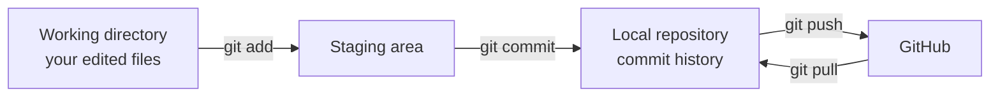

| Command | What it does |
|---|---|
| `git status` | Shows what's changed and what's staged. **Run this constantly** — it's always safe. |
| `git add <file>` | Stages a specific file for the next commit |
| `git add .` | Stages everything changed |
| `git commit -m "message"` | Saves a snapshot of staged changes, with a description |
| `git push` | Uploads your commits to GitHub |
| `git pull` | Downloads and merges teammates' latest commits |

**Good commit messages** are short, present-tense, and describe what changed and why — e.g. `"Fix typo in login error message"`, not `"changes"` or `"asdf"`.

### Example walkthrough

```powershell
# after editing notes.txt
git status
# On branch main
# Changes not staged for commit:
#   modified:   notes.txt

git add notes.txt

git commit -m "Update notes with meeting summary"
# [main 3f2a1b9] Update notes with meeting summary
#  1 file changed, 2 insertions(+)

git push
# Enumerating objects... done.
# To github.com:organization-name/project-name.git
#    a1b2c3d..3f2a1b9  main -> main
```

---

# 8. Working with Branches

A **branch** is an independent line of work. Using one per feature or fix keeps `main` always stable, so you can experiment freely without risking the working version of the project.

> ⚠️ **Create your branch *before* you start editing — not after.** If you edit and commit on `main` first and only *then* create your branch, the new branch will carry those `main` commits along with it, which can confuse your history later. If this already happened to you, see the recipe in [Section 15](#15-common-beginner-errors-and-fixes).

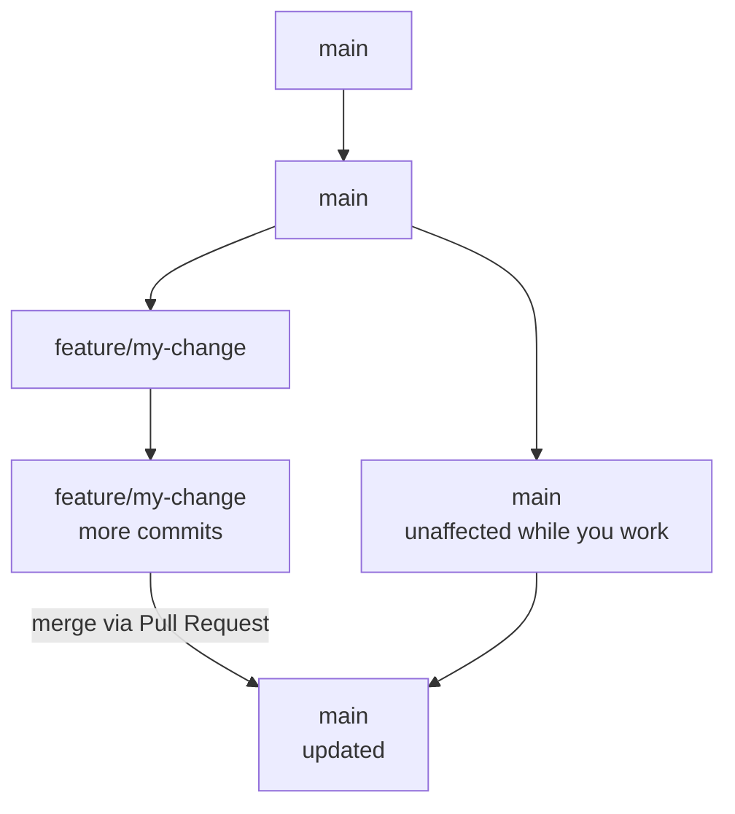

### Step-by-step: branch, work, push

```powershell
# 1. Make sure you're up to date with main first
git switch main
git pull origin main

# 2. Create a new branch and switch to it
git switch -c add-data-processing

# 3. Make your changes, then check what changed
git status

# 4. Stage your changes
git add .

# 5. Commit
git commit -m "Add data processing functionality"

# 6. Push the new branch to GitHub
git push -u origin add-data-processing
```

The `-u` (short for `--set-upstream`) links your local branch to its GitHub counterpart. After this **one-time** push, plain `git push` and `git pull` work on this branch without naming it again.

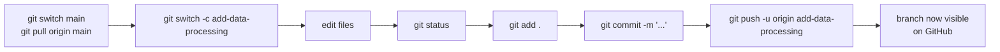

| Command | What it does |
|---|---|
| `git branch` | Lists local branches (current one is marked) |
| `git switch -c feature/my-change` | Creates **and** switches to a new branch |
| `git switch main` | Switches back to an existing branch |
| `git push -u origin feature/my-change` | Pushes a new branch the first time (the `-u` links it, so plain `push`/`pull` work afterward) |
| `git branch -d feature/my-change` | Deletes a local branch (only if already merged) |

> You may also see `git checkout -b feature/my-change` and `git checkout main` in older tutorials — they are the classic equivalents of `git switch -c` and `git switch`.

> ⚠️ **Common typo:** `git push -u origin` takes the remote name first, then the branch — `git push -u <remote> <branch>`. Writing `git push -u your-branch-name` (leaving out `origin`) makes Git think the branch name *is* the remote, and it fails with `fatal: 'your-branch-name' does not appear to be a git repository`.

### Confirming your branch exists

```powershell
git branch      # local branches only
git branch -r   # remote branches only
git branch -a   # both, local and remote
```

### Visualizing your branches

```powershell
git log --oneline --graph --all
```

Example output, one branch ahead of `main`:

```
* f828f36 (HEAD -> add-data-processing) Add data processing functionality
* 53968a5 (origin/main, main) Update notes with meeting summary
* 6a6e91e Initial commit
```

After it's merged (see [Section 9](#9-collaborating-with-pull-requests)), the graph shows the branches coming back together:

```
*   a1b2c3d Merge branch 'add-data-processing'
|\
| * f828f36 Add data processing functionality
|/
* 53968a5 Update notes with meeting summary
```

### Example

```powershell
git switch -c feature/update-notes
# Switched to a new branch 'feature/update-notes'

# ...edit files, then the same add / commit steps from Section 7...

git push -u origin feature/update-notes
# Branch 'feature/update-notes' set up to track 'origin/feature/update-notes'.
```

Ask your team if there's a preferred branch naming convention (e.g. `feature/...`, `fix/...`) — many teams have one.

---

# 9. Collaborating with Pull Requests

A **Pull Request (PR)** asks your team to review and merge your branch into `main`. This is how most teams collaborate on GitHub.

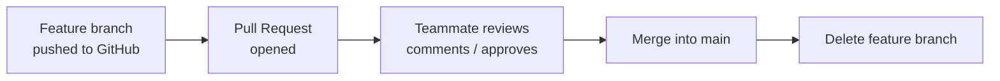

1. After pushing a branch (Section 8), open the repository on GitHub — you'll usually see a **Compare & pull request** button. (Or: **Pull requests** tab → **New pull request**.)
2. Fill in a title and description explaining what changed and why. Add reviewers if your team uses them.
3. Your team reviews: they may comment, request changes, or approve.
4. If changes are requested, just commit and push more changes to the **same branch** — the PR updates automatically. No need to open a new one.
5. Once approved, click the merge button — GitHub gives you three options (see below), so pick the one your team prefers if unsure — then **Delete branch** on GitHub.
6. Back in your terminal, clean up locally:

```powershell
git switch main
git pull
git branch -d feature/update-notes
```

## Choosing a Merge Strategy: Merge Commit vs. Squash vs. Rebase

When you click GitHub's merge button, it's actually a dropdown with three different options. They all end with your changes in `main` — they just structure the resulting history differently. Starting from the same branch:

```
* e5f6a7b (feature) Fix edge case
* c3d4e5f (feature) Add tests
* a1b2c3d (feature) Add data processing
* 9f8e7d6 (main, origin/main) Previous commit
```

### Option 1 — Create a merge commit (GitHub's default)

```
*   f1a2b3c (main) Merge pull request #12 from feature
|\
| * e5f6a7b Fix edge case
| * c3d4e5f Add tests
| * a1b2c3d Add data processing
|/
* 9f8e7d6 Previous commit
```

All three original commits are kept exactly as authored, plus a new **merge commit** tying the branch back into `main`. You get the full, exact record — including the branch shape itself — at the cost of `main`'s history filling up with a "Merge pull request #N" entry for every single PR.

### Option 2 — Squash and merge

```
* 7c8d9e0 (main) Add data processing (#12)
* 9f8e7d6 Previous commit
```

All three commits (`a1b2c3d`, `c3d4e5f`, `e5f6a7b`) are combined into **one brand-new commit** on `main`, usually titled after the PR. `main` stays perfectly linear — one clean commit per merged feature, easy to read and easy to `git revert` as a single unit. The trade-off: the individual "Add tests" / "Fix edge case" commits disappear from `main`'s history (they're still visible on the closed Pull Request itself, just not in `git log` on `main`).

### Option 3 — Rebase and merge

```
* e5f6a7b' (main) Fix edge case
* c3d4e5f' Add tests
* a1b2c3d' Add data processing
* 9f8e7d6 Previous commit
```

The same three commits are replayed one-by-one directly onto `main` — no merge commit — each keeping its own message, but getting a new commit hash (marked `'` above). `main` stays linear like squash, but you keep the granular, commit-by-commit history instead of collapsing it. The trade-off: any messy "oops," "fix typo," or "wip" commits from the branch show up individually on `main` too, since nothing gets combined.

### Which one to pick

| Strategy | `main` history after merge | Keeps individual commits? | CLI equivalent (if merging locally) |
|---|---|---|---|
| **Create a merge commit** | Branch shape preserved (fork + join) | Yes, all of them, plus a new merge commit | `git merge feature-branch` |
| **Squash and merge** | Linear — one new commit per PR | No — combined into one | `git merge --squash feature-branch` then `git commit` |
| **Rebase and merge** | Linear — one commit per original, new hashes | Yes, each one individually | `git rebase main` (run on the feature branch), then a fast-forward merge |

Most teams — including most large tech companies (see [Beyond the Basics](#beyond-the-basics-how-professional-teams-work-at-scale)) — default to **Squash and merge**, since a clean, one-line-per-feature `main` history is easier to read, easier to bisect when hunting for a bug, and easier to revert. This is usually a **repository-wide setting** an admin picks once (Settings → General → Pull Requests), not something you choose per PR — if you only ever see one option, that's why.

> ⚠️ Squash and rebase both rewrite commit hashes. That's harmless when GitHub does it for you at merge time — just don't run `git rebase` yourself on a branch other people have already pulled, without warning them first.

## Merging Locally (Without a Pull Request)

You *can* merge a branch into `main` entirely from the command line, skipping GitHub's review step:

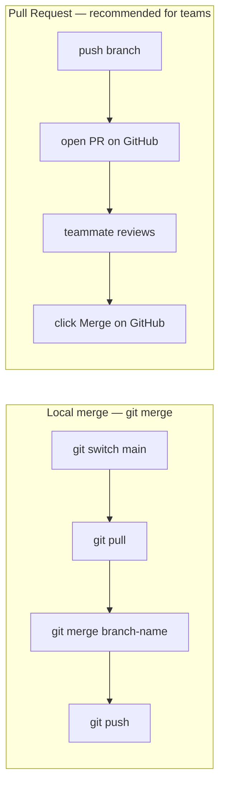

```powershell
# 1. Push your branch first (also needed if you change your mind and want a PR)
git push -u origin feature/update-notes

# 2. Switch back to main
git switch main

# 3. Get the latest main
git pull origin main

# 4. Merge your branch into main
git merge feature/update-notes

# 5. Push the updated main
git push origin main
```

If Git can't automatically combine the changes, it tells you there's a conflict — resolve it using [Section 13](#13-resolving-a-merge-conflict), then finish with `git add` and `git commit`.

> ⚠️ **Use the Pull Request method above for any shared or company repository.** Local merging skips code review entirely and leaves no record of who approved the change. It's only appropriate for solo projects or personal experiments — for a team repo, push your branch and open a Pull Request instead.

### The Full Pull Request Lifecycle, Start to Finish

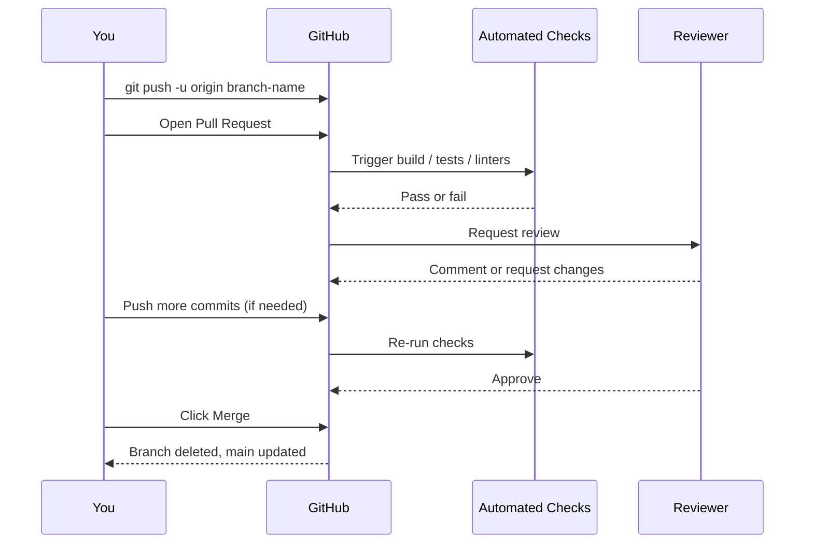

This is the same loop covered in Steps 1–6 above — the diagram just shows all the moving parts (you, GitHub, automated checks, your reviewer) at once. See [Beyond the Basics](#beyond-the-basics-how-professional-teams-work-at-scale) below for what typically happens *after* this point at larger companies.

---

# 10. Keeping Your Local Copy Up to Date

Always `git pull` on `main` **before** starting new work, so any new branch you create starts from the latest code.

* `git fetch` — checks GitHub for new commits without changing your files.
* `git pull` — does a fetch, **and** merges those commits into your current branch. This is what you'll use almost all the time.

If Git says your branch is "behind," run `git pull`. If it says "ahead," you have local commits not yet pushed — run `git push`.

---

# 11. Undoing Mistakes Safely

Always start with `git status` to see exactly what state you're in.

| Situation | Command | Notes |
|---|---|---|
| Unstage a file (keep the edits) | `git restore --staged <file>` | Safe |
| Discard uncommitted edits to a file | `git restore <file>` | ⚠️ Cannot be undone — the edits are gone |
| Fix the last commit's message | `git commit --amend -m "corrected message"` | Only do this **before** pushing |
| View history | `git log --oneline` | Safe, read-only |
| Undo a commit that's already pushed/shared | `git revert <commit-hash>` | Safe — adds a new commit that reverses the change, history stays intact |

> ⚠️ Avoid `git reset --hard` unless you fully understand what it does — it can permanently delete uncommitted work with no undo. When in doubt, `git revert` is the safe option for anything already shared with others.

---

# 12. Ignoring Files You Don't Want to Commit (.gitignore)

A `.gitignore` file tells Git to never track certain files — build output, dependencies, secrets, OS junk files.

Create a `.gitignore` in the repo's root folder, for example:

```
node_modules/
.env
*.log
.DS_Store
Thumbs.db
bin/
obj/
```

> Check whether the project already has a `.gitignore` — most do. Ask a teammate if you're unsure what belongs in it for your specific project.

Note: `.gitignore` only prevents **new** files from being tracked. To stop tracking a file that's already committed:

```powershell
git rm --cached <file>
git commit -m "Stop tracking <file>"
```

---

# 13. Resolving a Merge Conflict

A conflict happens when two people changed the **same lines** of the same file, and Git can't automatically decide which version should win. This is a normal part of teamwork, not a sign you did something wrong.

The affected file will contain markers like this:

```
<<<<<<< HEAD
your version of the line
=======
their version of the line
>>>>>>> branch-name
```

To resolve it:

1. Open the file and decide what the final content should be — keep your version, theirs, or a combination.
2. Delete the `<<<<<<<`, `=======`, and `>>>>>>>` marker lines entirely.
3. Save the file, then:

```powershell
git add <file>
git commit --no-edit
```

> 💡 VS Code highlights conflicts visually with **Accept Current / Incoming / Both** buttons, which handles the marker cleanup for you — helpful if you'd rather not edit the markers by hand.

---

# 14. Git and GitHub Cheat Sheet

**Setup & Identity**

| Task | Command |
|---|---|
| Check Git is installed | `git --version` |
| Set your name (once) | `git config --global user.name "Your Name"` |
| Set your email (once) | `git config --global user.email "you@company.com"` |
| View your settings | `git config --global --list` |
| Test GitHub connection | `ssh -T git@github.com` |

**Getting a Repository**

| Task | Command |
|---|---|
| Clone an existing repo | `git clone git@github.com:org/repo.git` |
| Check remotes | `git remote -v` |

**Everyday Workflow**

| Task | Command |
|---|---|
| See what changed | `git status` |
| Stage a file | `git add <file>` |
| Stage everything | `git add .` |
| Commit staged changes | `git commit -m "message"` |
| Upload commits | `git push` |
| Download latest changes | `git pull` |
| View history | `git log --oneline` |

**Branches**

| Task | Command |
|---|---|
| List local branches | `git branch` |
| List remote branches | `git branch -r` |
| List all branches (local + remote) | `git branch -a` |
| Create + switch to new branch | `git switch -c branch-name` |
| Switch branch | `git switch branch-name` |
| Push a new branch the first time | `git push -u origin branch-name` |
| Merge a branch into your current branch | `git merge branch-name` |
| Visualize branch history | `git log --oneline --graph --all` |
| Delete a local branch | `git branch -d branch-name` |
| Delete a remote branch | `git push origin --delete branch-name` |

**Undo / Fix**

| Task | Command |
|---|---|
| Unstage a file | `git restore --staged <file>` |
| Discard uncommitted changes to a file ⚠️ | `git restore <file>` |
| Fix last commit message (before push) | `git commit --amend -m "new message"` |
| Undo a pushed commit safely | `git revert <commit-hash>` |

---

# 15. Common Beginner Errors and Fixes

| Message | What it means | Fix |
|---|---|---|
| `fatal: not a git repository (or any of the parent directories): .git` | You're not inside a cloned/initialized project folder | `cd` into the project folder — see [Section 6](#6-cloning-your-first-repository) |
| `Please tell me who you are` | Git doesn't know your name/email yet | Set your identity — [Section 5](#5-setting-your-git-identity) |
| `Permission denied (publickey)` | GitHub doesn't recognize your SSH key | Redo SSH setup — [Section 4](#4-setting-up-ssh-authentication) |
| `fatal: The current branch has no upstream branch` | This branch has never been pushed before | Run `git push -u origin branch-name` once |
| `Updates were rejected because the remote contains work that you do not have locally` | A teammate pushed changes you don't have yet | `git pull`, then push again |
| `fatal: 'your-branch-name' does not appear to be a git repository` after `git push -u your-branch-name` | You left out the remote name — Git read your branch name as the remote instead | Use `git push -u origin your-branch-name`. The syntax is `git push -u <remote> <branch>`; `origin` is almost always the remote |
| `Your name and email address were configured automatically based on your username and hostname` (shown after a commit) | You committed before setting your Git identity — Git guessed values GitHub won't recognize as you | Set your identity explicitly — [Section 5](#5-setting-your-git-identity). Fix a commit already made with `git commit --amend --reset-author` |
| Conflict markers (`<<<<<<<`) appear in a file | Two people edited the same lines | See [Section 13](#13-resolving-a-merge-conflict) |

### "I accidentally committed directly to `main` instead of a branch"

If you haven't pushed yet (`git status` says "ahead of origin/main"), this recipe moves your commits onto a new branch and restores `main`:

```powershell
git branch feature/oops
git fetch origin
git reset --hard origin/main
git switch feature/oops
```

Your commits are now safely on `feature/oops`, and `main` matches GitHub again. **Only do this if you haven't pushed** — if you already pushed to `main`, ask a teammate for help instead of resetting.

---

# 16. Glossary of Terms

* **Repository ("repo")** — a project's folder plus its entire history, tracked by Git.
* **Clone** — download a full copy of a repository (including history) to your computer.
* **Commit** — a saved snapshot of changes, with a message describing what changed.
* **Branch** — an independent line of work, so you can make changes without affecting `main`.
* **main** — the default/primary branch, usually the "official" version of the project.
* **Merge** — combining the changes from one branch into another.
* **Remote** — a version of the repository hosted elsewhere (e.g. on GitHub).
* **origin** — the default name Git gives to the remote you cloned from.
* **Push** — upload your local commits to a remote (GitHub).
* **Pull** — download and merge commits from a remote into your local branch.
* **Fetch** — check the remote for new commits without merging them yet.
* **Fork** — your own copy of someone else's repository, under your own account.
* **Pull Request (PR)** — a request on GitHub to merge one branch into another, with room for review and discussion.
* **Staging area** — the "waiting area" for changes you've `git add`-ed but not yet committed.
* **Working directory** — the actual files on your computer, as you see them in your editor.
* **HEAD** — a pointer to whatever commit/branch you currently have checked out.
* **Checkout / Switch** — move to a different branch (or restore files to a prior state).
* **.gitignore** — a file listing things Git should never track (e.g. build output, secrets).
* **SSH key** — a pair of cryptographic files that let your computer prove its identity to GitHub without a password.
* **ssh-agent** — a background helper that holds your unlocked SSH key so you don't retype your passphrase constantly.
* **Merge conflict** — when Git can't automatically combine two changes to the same lines and needs a human decision.
* **Upstream** — the remote branch a local branch is linked to for push/pull.

That's everything you need for day-to-day work with your organization's repositories. The section below is optional context on how this same workflow scales up at large engineering organizations. After that, Part 2 covers adding a second (personal) GitHub account on this same computer.

---

# Beyond the Basics: How Professional Teams Work at Scale

Everything above is the real workflow — professional engineering organizations don't do anything fundamentally different. They just add layers of automation and process around the exact same `branch → commit → push → pull request → merge` loop. This section covers why some of the terminology is named the way it is, and what actually happens to a change at a company with thousands of engineers and millions of users.

## Why the Names Are Weird ("Pull Request," but You're Pushing)

A common point of confusion: you `git push` your branch to GitHub, so why is it called a **Pull Request** instead of a "Push Request"?

| Term | Why it's called that |
|---|---|
| **Push** | You're uploading your commits *outward* — from your machine to the remote. |
| **Pull** | You're downloading commits *inward* — from the remote to your machine. |
| **Pull Request** | This predates GitHub. In the early Git/Linux-kernel workflow, a contributor would ask a maintainer to `git pull` changes from their branch into the official repository — Git even has a literal `git request-pull` command for generating that request. The name describes the **maintainer's** action (they pull your work in), not yours. You push your branch to a remote either way — the "pull" in the name refers to what happens on the receiving end, not what you personally typed. |
| **Merge Request** (GitLab's name for the identical feature) | Describes the *result* (a merge) instead of the historical mechanism — same feature, different naming philosophy. Bitbucket and Azure DevOps both stuck with "Pull Request." |
| **Fork** | A "fork in the road" — your own independent copy of someone else's repository, under your account. |
| **Clone** | An exact copy, including full history — like a biological clone. |
| **origin** | Just the conventional default name Git gives the remote you cloned from. You can rename it; almost nobody does. |
| **HEAD** | A pointer to "where you currently are" in the history — the term predates Git, inherited from older version control systems where it meant the tip of a branch. |
| **main** (formerly `master`) | GitHub, GitLab, and most of the industry renamed the default branch from `master` to `main` around 2020, for more inclusive terminology. Older repos and tutorials still say `master`. |
| **git** | Named by its creator, Linus Torvalds, after — by his own joking admission — British slang for an unpleasant person: *"I'm an egotistical bastard, and I name all my projects after myself. First 'Linux', now 'git'."* |

## The Full Lifecycle of a Change

What actually happens between "I made an update" and "users have it," end to end:

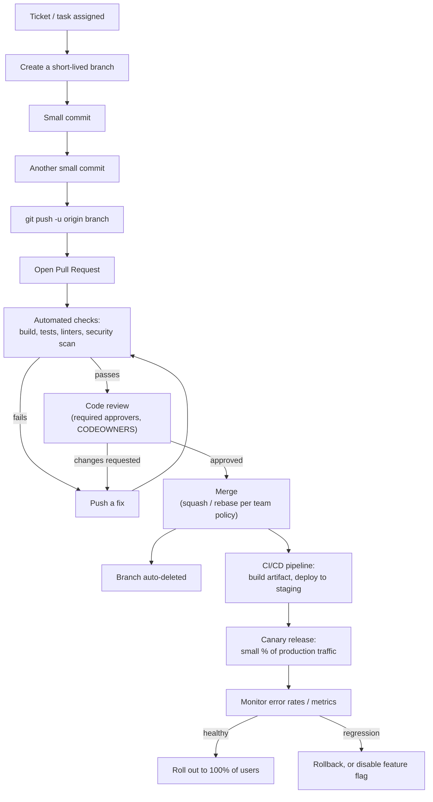

The part beginner tutorials usually stop at — "Merge" — is roughly the *midpoint* of this process at a company with real production traffic, not the end.

## Git-flow vs. Trunk-Based Development

Two competing philosophies for how branches map to releases:

| | Git-flow (traditional) | Trunk-Based Development (most modern "big tech") |
|---|---|---|
| Branch lifespan | Long-lived: `main`, `develop`, `feature/*`, `release/*`, `hotfix/*` | Hours to a couple of days, then merged |
| How `main` gets updated | Only at release time, via `release` branches | Continuously — many merges a day, from every engineer |
| How unfinished work stays hidden | Kept isolated on a feature branch until ready | Merged to `main` anyway, hidden behind a **feature flag** |
| Best suited for | Versioned software with a slower release cadence (desktop apps, firmware) | Continuously deployed web services, large monorepos |
| Roughly used by | Many traditional enterprises, some packaged-software teams | Google, Meta, most modern SaaS engineering orgs |

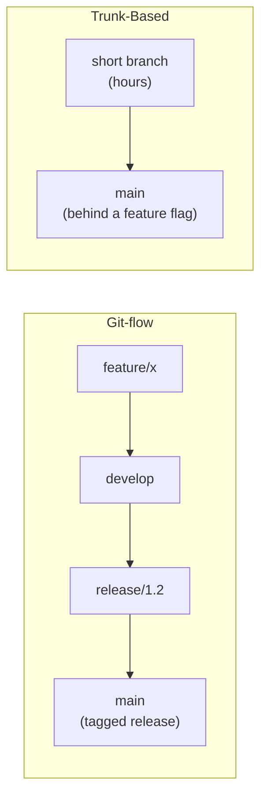

## How Apple, Google, Microsoft, and Meta Actually Do This

* **Google** doesn't run most of its codebase on Git or GitHub internally. Engineers commit small, frequent changes ("Changelists," or CLs) into one giant monorepo, built on an internal system called Piper, reviewed through an internal tool called Critique. Conceptually it's identical to a GitHub Pull Request — propose a change, get it reviewed and tested, merge — just different names and different plumbing. Google's *public* projects (Android, Chromium, Kubernetes, Go) do use ordinary Git and GitHub-style PRs.
* **Microsoft** owns GitHub and is one of its largest users — most modern Microsoft teams use trunk-based development on GitHub or Azure DevOps: short-lived branches, mandatory PR review, and required CI status checks before the Merge button is even clickable.
* **Meta (Facebook)** helped popularize trunk-based development at scale — nearly everything lands on `main` behind a feature flag, historically reviewed through an internal tool called Phabricator, with very heavy automated testing as the safety net instead of long-lived branches.
* **Apple** is famously compartmentalized: engineers typically only get access to the parts of the codebase relevant to their team, code review is mandatory, and very little is public about their internal tooling — deliberately, for secrecy.

Across all four: **nobody pushes straight to `main`.** Every one of these companies enforces the same discipline this guide teaches — branch (or its local equivalent), review, automated checks, then merge — just at a scale of thousands of changes a day instead of one.

## Enforcing the Rules: Branch Protection, CODEOWNERS, Required Checks

Large orgs don't rely on people *remembering* to open a Pull Request — they configure GitHub so skipping one isn't possible:

| Mechanism | What it does |
|---|---|
| **Branch protection rule on `main`** | Blocks direct pushes entirely; a Pull Request becomes the only way in |
| **Required approvals** | A minimum number of reviewers (often 1–2) must approve before the PR can merge |
| **CODEOWNERS file** | Automatically requests review from the right team or person, based on which files changed |
| **Required status checks** | CI (build, tests, linters, security/dependency scans) must pass — the Merge button stays disabled otherwise |
| **Merge strategy policy** | Many orgs default to **Squash and merge**, so `main`'s history is one clean commit per change — easy to read, and easy to `git revert` if it breaks something |

## From Merge to Production: Canary Releases and Feature Flags

Merging a Pull Request is rarely the end of the story at a company with real users:

1. The merge triggers a **CI/CD pipeline** — build, package into a deployable artifact, deploy to a staging environment, run integration tests.
2. Many companies then do a **canary release**: the new code ships to a small percentage of production traffic or users first.
3. Automated monitoring watches error rates and metrics; if something looks wrong, it's rolled back — or the responsible **feature flag** is simply flipped off, often without needing a new deploy at all.
4. Only once the canary looks healthy does the change roll out to 100% of users.

This is why, especially at large companies, "merged" and "every user has it" are two different moments in time — sometimes hours or days apart.

---

# Part 2: Managing Personal and Work Accounts on One Computer

A complete step-by-step guide for using **multiple GitHub accounts** (for example, a personal GitHub account and a company/organization GitHub account) on the same computer using SSH authentication.

> **Note on labels:** the steps below assume your existing default key (`id_ed25519`) is your **personal** account, and you're adding a **work** key. If you completed [Part 1](#part-1-getting-started-with-git-and-github-single-organization-account) first, it's the other way around — your default key is already your **work/organization** key, and you're now adding a **personal** one. Everything below still applies; just swap "personal" and "work" wherever they appear, and pick whichever new filename makes sense (e.g. `id_ed25519_personal`).

## The Big Picture

Everything in this part builds toward one routing setup: two keys, two aliases, one machine.

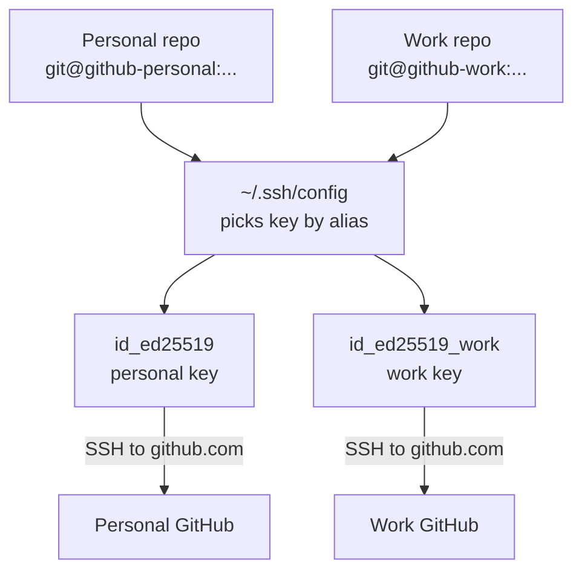

The **host alias** in the URL (`github-personal` vs `github-work`) is what tells SSH which key to use — that is the whole trick.

---

# 17. Understanding Git Identity vs GitHub Authentication

Git uses two **separate and independent** concepts. Confusing them is the root cause of most multi-account problems.

## GitHub Authentication

This answers:

> "Which GitHub account am I connecting to, and am I allowed in?"

Handled by:

* SSH keys (the credential)
* The SSH config file (which key to use for which alias)

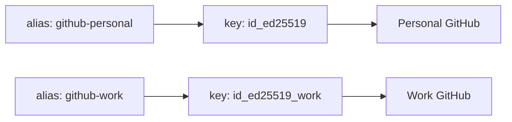

## Git Commit Identity

This answers:

> "Whose name and email are recorded as the author of each commit?"

Controlled by:

```bash
git config user.name
git config user.email
```

| | Name | Email |
|---|---|---|
| **Personal** | Your Name | `personal@example.com` |
| **Work** | Your Name | `your.name@company.com` |

## Two Independent Systems

These two systems do not talk to each other — you configure each one separately:

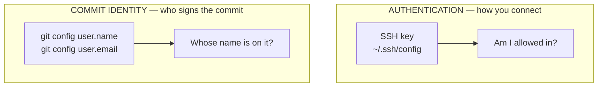

> **Key point:** Because they are independent, you can authenticate with your work key but still commit with your personal email if you are not careful — this guide shows how to keep them aligned (see [Section 26](#26-configuring-git-commit-identity)).

---

# 18. Prerequisites

You need:

* **Git** installed
* One or more **GitHub accounts**
* **OpenSSH** (bundled with Git and included in modern Windows, macOS, and Linux)

> If you completed [Part 1](#part-1-getting-started-with-git-and-github-single-organization-account), you already have both — skip to [Section 19](#19-checking-existing-ssh-setup).

Check Git:

```powershell
git --version
```

Check SSH:

```powershell
ssh -V
```

If either command is not found, install [Git](https://git-scm.com/downloads) (which includes OpenSSH) before continuing.

---

# 19. Checking Existing SSH Setup

Look at your SSH folder to see what already exists.

```powershell
cd ~/.ssh
ls
```

> On macOS/Linux use `ls -la ~/.ssh` to also show the hidden `config` file.

Typical files:

```
id_ed25519       # private key  (NEVER share this)
id_ed25519.pub   # public key   (safe to share)
known_hosts
```

The default key `id_ed25519` is usually your **personal** GitHub key. If the `.ssh` folder is empty, you will create both keys below.

> ⚠️ **Never share, commit, or paste a private key** (a file with **no** `.pub` extension). Only `.pub` files are meant to be uploaded to GitHub.

---

# 20. Creating a Work SSH Key

**Do NOT overwrite your existing key.** Create a second one with a distinct filename.

```powershell
ssh-keygen -t ed25519 -C "your.name@company.com"
```

* `-t ed25519` — the recommended modern key type.
* `-C "..."` — a comment/label (typically your email) so you can identify the key later. It does **not** affect authentication.

When prompted:

```
Enter file in which to save the key:
```

**Do NOT press Enter** (that would target the default `id_ed25519` and could overwrite your personal key). Type a distinct path:

```
~/.ssh/id_ed25519_work
```

On Windows the resolved path looks like:

```
C:\Users\<YourUser>\.ssh\id_ed25519_work
```

Set a passphrase when asked (recommended). After completion you will have:

```
id_ed25519_work       # private key
id_ed25519_work.pub   # public key
```

---

# 21. Starting ssh-agent and Adding Keys

The **ssh-agent** holds your unlocked keys so you don't retype the passphrase every time.

### Windows

Check the agent service:

```powershell
Get-Service ssh-agent
```

Start it (and make it start automatically on boot):

```powershell
Start-Service ssh-agent
Set-Service ssh-agent -StartupType Automatic
```

> If `Set-Service` reports an access error, run PowerShell **as Administrator** for that one command.

### macOS / Linux

The agent usually runs already. If not:

```bash
eval "$(ssh-agent -s)"
```

### Add both keys (all platforms)

```powershell
ssh-add ~/.ssh/id_ed25519
ssh-add ~/.ssh/id_ed25519_work
```

> On macOS, store the passphrase in the keychain with:
> `ssh-add --apple-use-keychain ~/.ssh/id_ed25519_work`

Verify the loaded keys:

```powershell
ssh-add -l
```

Expected (fingerprints will differ):

```
256 SHA256:xxxxx personal@example.com (ED25519)
256 SHA256:yyyyy your.name@company.com (ED25519)
```

---

# 22. Adding SSH Keys to GitHub

You upload the **public** key (`.pub`) to each corresponding GitHub account.

Copy a public key to the clipboard:

```powershell
# Personal
Get-Content ~/.ssh/id_ed25519.pub | Set-Clipboard

# Work
Get-Content ~/.ssh/id_ed25519_work.pub | Set-Clipboard
```

> macOS: `pbcopy < ~/.ssh/id_ed25519.pub` — Linux: `xclip -sel clip < ~/.ssh/id_ed25519.pub`
> Or just print it with `Get-Content ~/.ssh/id_ed25519.pub` and copy manually.

Then, **while signed in to the matching account**:

1. GitHub → click your profile picture → **Settings**
2. **SSH and GPG keys** → **New SSH key**
3. **Title:** a device/account label, e.g. `Personal Laptop` or `Company Laptop`
4. **Key type:** `Authentication Key`
5. **Key:** paste the public key
6. **Add SSH key**

Repeat for the work account, **signed in to the work account**, using `id_ed25519_work.pub`.

> Make sure each public key is added to the correct account. The personal key goes on the personal account; the work key on the work account.

## Authorize the Work Key for Your Organization (SAML SSO)

Many companies protect their repositories with **SAML single sign-on (SSO)**. When that is enabled, adding the key to your account is not enough on its own — you must also **authorize the key for the organization** before you can clone or push its repositories. Do this right after adding the work key:

1. Open your SSH key settings: [https://github.com/settings/keys](https://github.com/settings/keys)
2. Find the work key you just added (e.g. titled `Company Laptop`).
3. Click **Configure SSO** next to that key.
4. Click **Authorize** next to your organization's name.
5. Complete your company sign-in if prompted.

The key is now trusted for that organization and will work for cloning and pushing to its repositories.

> If your organization does not use SSO, you can skip this step. If you are unsure, do it anyway — it is harmless.

---

# 23. Creating the SSH Configuration File

The config file maps a **host alias** to a specific key. This is what lets one machine reach two accounts on the same `github.com`.

Create the file at:

```
~/.ssh/config
```

The filename must be exactly `config` — **not** `config.txt`.

> **Windows tip:** Notepad often adds a hidden `.txt`. Create it from PowerShell instead:
> ```powershell
> notepad $HOME\.ssh\config
> ```
> Save it, then confirm with `ls ~/.ssh` that the file is named `config` with no extension.

Contents:

```ssh-config
# Personal GitHub
Host github-personal
    HostName github.com
    User git
    IdentityFile ~/.ssh/id_ed25519
    IdentitiesOnly yes

# Work GitHub
Host github-work
    HostName github.com
    User git
    IdentityFile ~/.ssh/id_ed25519_work
    IdentitiesOnly yes
```

What each line does:

* `Host github-personal` — the **alias** you type in URLs (`git@github-personal:...`).
* `HostName github.com` — the real server both aliases connect to.
* `User git` — GitHub always authenticates SSH as the `git` user.
* `IdentityFile` — which private key to use for this alias.
* `IdentitiesOnly yes` — **use only the listed key**. Without this, ssh-agent offers every loaded key and GitHub logs you in as whichever key it recognizes first — the #1 cause of "wrong account" errors. **Do not omit this line.**

Why `IdentitiesOnly yes` matters:

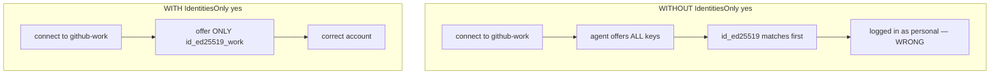

---

# 24. Testing Both GitHub Accounts

Test personal:

```powershell
ssh -T git@github-personal
```

Expected:

```
Hi personal-username! You've successfully authenticated, but GitHub does not provide shell access.
```

Test work:

```powershell
ssh -T git@github-work
```

Expected:

```
Hi work-username! You've successfully authenticated, but GitHub does not provide shell access.
```

> The first time you connect you'll see a prompt about the authenticity of `github.com` — type `yes` to add it to `known_hosts`.
>
> The message says GitHub "does not provide shell access" — that is expected and means success.

If the wrong username appears, jump to [Troubleshooting](#30-troubleshooting-multi-account).

---

# 25. Cleaning Up Duplicate / Cached Keys

Sometimes `ssh-add -l` shows extra or stale keys:

```
SHA256:key1 personal@example.com
SHA256:key2 personal@example.com   # duplicate / old
SHA256:key3 your.name@company.com
```

Identify the fingerprint of a key file directly:

```powershell
ssh-keygen -lf ~/.ssh/id_ed25519.pub
```

Reset the agent and re-add only the keys you want:

```powershell
ssh-add -D                       # remove all keys from the agent
ssh-add ~/.ssh/id_ed25519
ssh-add ~/.ssh/id_ed25519_work
ssh-add -l                       # verify: exactly two keys
```

> `ssh-add -D` only clears the agent's memory; it does **not** delete any key files.

---

# 26. Configuring Git Commit Identity

There is no global "correct" identity — set it per repository (or automate it) so personal repos use your personal email and work repos use your work email.

## Option A — Set per repository (simple, explicit)

Run inside each repository after cloning:

**Personal repo:**

```powershell
git config user.name "Your Name"
git config user.email "personal@example.com"
```

**Work repo:**

```powershell
git config user.name "Your Name"
git config user.email "your.name@company.com"
```

Verify inside a repo:

```powershell
git config user.email
```

## Option B — Automatic per-folder identity (recommended)

Git can switch identity automatically based on where a repository lives, so you never forget. This uses `includeIf` in your **global** Git config.

Assume you keep repos like this:

```
~/Projects/Personal/...
~/Projects/Work/...
```

Edit your global config:

```powershell
notepad $HOME\.gitconfig
```

Add:

```ini
[user]
    name = Your Name
    email = personal@example.com        # default identity

[includeIf "gitdir:~/Projects/Work/"]
    path = ~/.gitconfig-work
```

Create `~/.gitconfig-work`:

```ini
[user]
    email = your.name@company.com
```

Now any repo under `~/Projects/Work/` automatically commits with your work email; everything else uses the personal default.

How Git decides which email to use, based on where the repo lives:

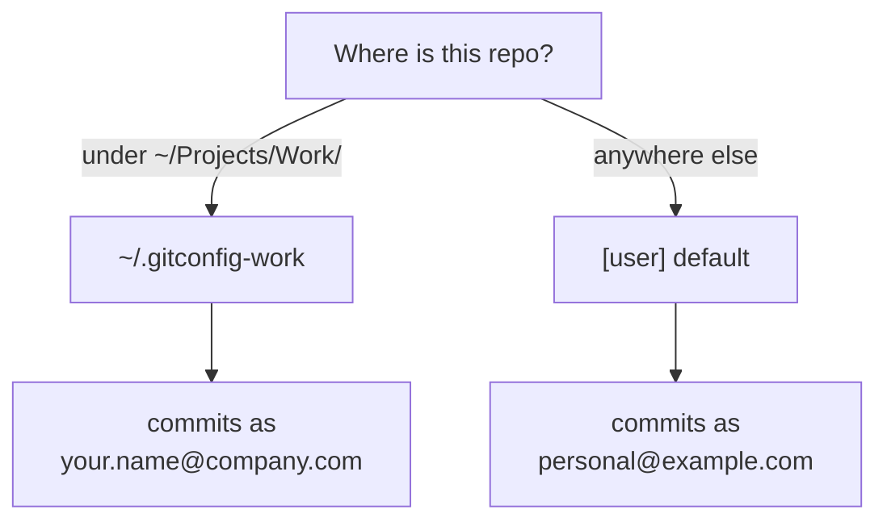

> The trailing slash in `gitdir:~/Projects/Work/` matters — it means "this directory and everything under it." On Windows, `~` resolves to your user home folder.

Confirm which identity a repo resolved to:

```powershell
git config user.email
```

---

# 27. Recommended Workflow

Keep personal and work repositories in **separate folders**. This prevents mixing remotes, identities, and accidental cross-pushes.

```
Projects/
├── Personal/
│   └── project-a/
└── Work/
    └── company-project/
```

Clone using the **host alias** from your SSH config (not `github.com`):

**Personal:**

```powershell
git clone git@github-personal:personal-username/project-a.git
```

**Work:**

```powershell
git clone git@github-work:organization-name/company-project.git
```

> The part after the colon is `owner/repository`. Use your **username** for personal repos and the **organization name** for work repos. Copy the real `owner/repo` from the GitHub repository page and just swap `github.com` for your alias.

Cloning through the alias means the correct key is used automatically for every future `pull`/`push` in that repo — no per-command flags needed.

This separation prevents:

* Accidentally pushing company code to a personal (possibly public) repo
* Commits authored with the wrong email
* Authentication confusion

---

# 28. Using One Repository With Multiple GitHub Accounts

A single local folder can push to more than one account by having multiple **named remotes**.

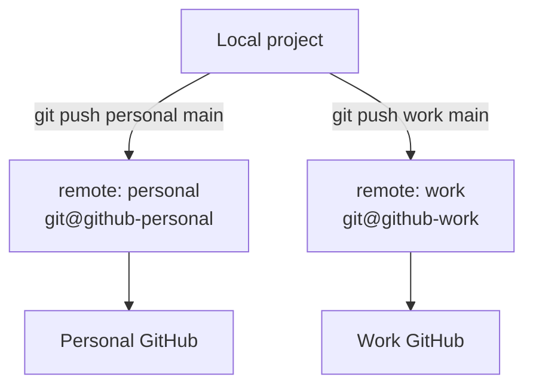

Initialize and make a first commit:

```powershell
git init
git add .
git commit -m "Initial commit"
```

Add two remotes using the aliases:

```powershell
git remote add personal git@github-personal:personal-username/project.git
git remote add work git@github-work:organization-name/project.git
```

Check them:

```powershell
git remote -v
```

Push to each explicitly:

```powershell
git push personal main
git push work main
```

> This keeps the two destinations independent — you choose which one to push to each time.

---

# 29. Automatically Push to Multiple Accounts

You can make a single remote push to **two destinations at once**.

```powershell
git remote add origin git@github-personal:personal-username/project.git
git remote set-url --add --push origin git@github-work:organization-name/project.git
```

Now:

```powershell
git push origin main
```

pushes to **both** the personal and work repositories.

## ⚠️ Warning

**Avoid this for company projects.** Reasons:

* Company code can accidentally end up on personal (potentially public) GitHub
* It may violate your employer's security or IP policies
* Once pushed publicly, code can be cached or forked before you can delete it

**Recommended:** use separate repositories (see [Section 27](#27-recommended-workflow)) unless you have explicit authorization to mirror.

---

# 30. Troubleshooting (Multi-Account)

## "Could not resolve hostname github-work"

**Cause:** the SSH config isn't being read (missing file, wrong name, or wrong location).

**Fix:**

```powershell
ls ~/.ssh
```

Confirm a file named exactly `config` exists (not `config.txt`, and located in `~/.ssh`). Recreate it per [Section 23](#23-creating-the-ssh-configuration-file) if needed.

## Wrong GitHub account appears (`Hi wrong-username!`)

**Most common cause:** `IdentitiesOnly yes` is missing from your SSH config, so the agent offers the wrong key first.

**Fix:**

1. Add `IdentitiesOnly yes` under **both** hosts in `~/.ssh/config` (see [Section 23](#23-creating-the-ssh-configuration-file)).
2. Reset the agent:

   ```powershell
   ssh-add -D
   ssh-add ~/.ssh/id_ed25519
   ssh-add ~/.ssh/id_ed25519_work
   ```
3. Re-test: `ssh -T git@github-work`

## Verify which key is being offered

```powershell
ssh -vT git@github-work
```

Look for lines like:

```
Offering public key: ~/.ssh/id_ed25519_work ...
Authenticated to github.com ... using "publickey"
```

Confirm the **expected key file** is the one that authenticates.

## "Permission denied (publickey)"

* The public key isn't added to that GitHub account, or was added to the wrong account → re-check [Section 22](#22-adding-ssh-keys-to-github).
* The key isn't loaded in the agent → `ssh-add -l`, then re-add it.
* Wrong `IdentityFile` path in `~/.ssh/config`.

## A repo still uses the old account after you fixed the config

The remote URL was probably cloned with `github.com` instead of the alias. Check and fix:

```powershell
git remote -v
git remote set-url origin git@github-work:organization-name/project.git
```

## Passphrase prompts every session (Windows)

Ensure the agent starts automatically:

```powershell
Set-Service ssh-agent -StartupType Automatic
```

---

# 31. Quick Reference (Multi-Account)

| Task | Command |
|---|---|
| Create work key | `ssh-keygen -t ed25519 -C "your.name@company.com"` (save as `id_ed25519_work`) |
| Start agent (Win) | `Start-Service ssh-agent` |
| Add key | `ssh-add ~/.ssh/id_ed25519_work` |
| List loaded keys | `ssh-add -l` |
| Clear agent | `ssh-add -D` |
| Copy public key (Win) | `Get-Content ~/.ssh/id_ed25519.pub \| Set-Clipboard` |
| Test connection | `ssh -T git@github-work` |
| Debug connection | `ssh -vT git@github-work` |
| Clone (work) | `git clone git@github-work:organization-name/project.git` |
| Set commit email | `git config user.email "your.name@company.com"` |
| List remotes | `git remote -v` |

---

# Final Recommended Setup

Your final `~/.ssh` folder:

```
.ssh/
├── config
├── id_ed25519         # personal (private)
├── id_ed25519.pub     # personal (public)
├── id_ed25519_work    # work (private)
├── id_ed25519_work.pub# work (public)
└── known_hosts
```

ssh-agent holds:

```
✓ Personal GitHub key
✓ Work GitHub key
```

Git routing:

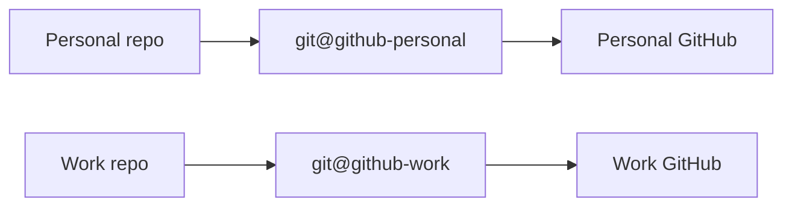

Result: a clean, secure, and reliable way to manage multiple GitHub accounts on one computer — with authentication and commit identity kept correctly separated.
